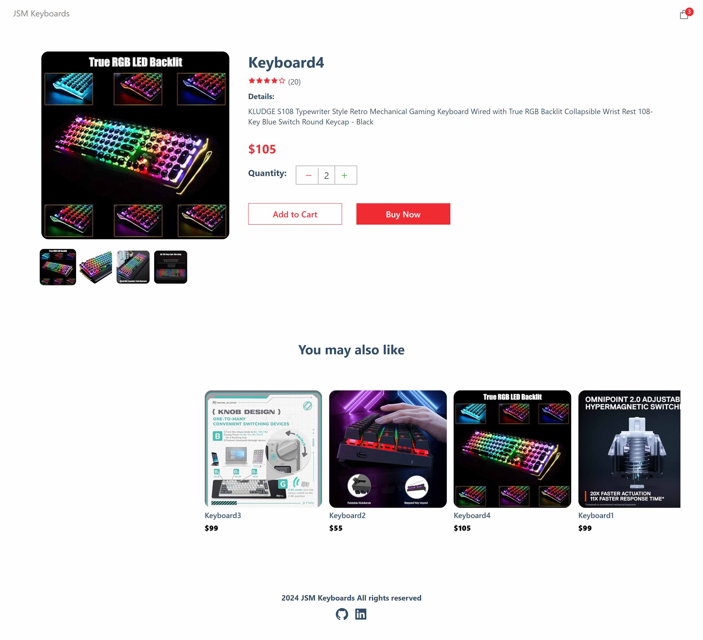
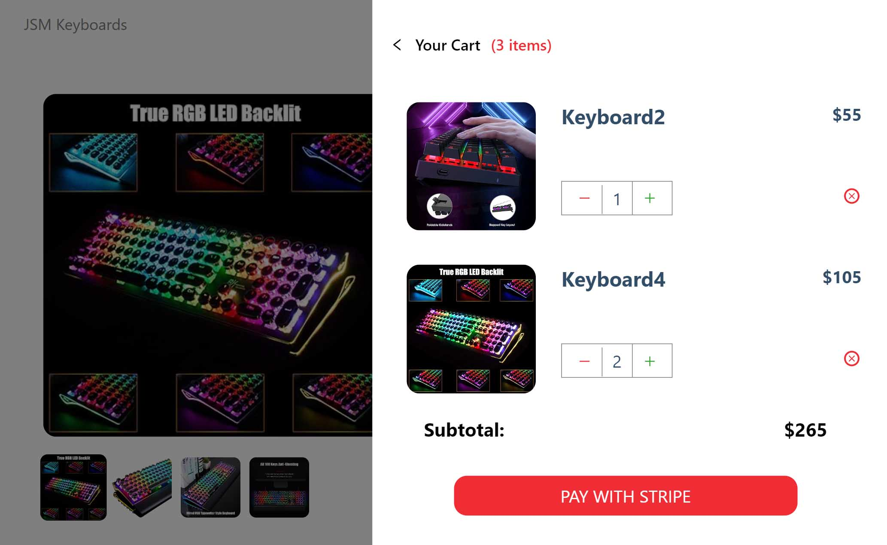
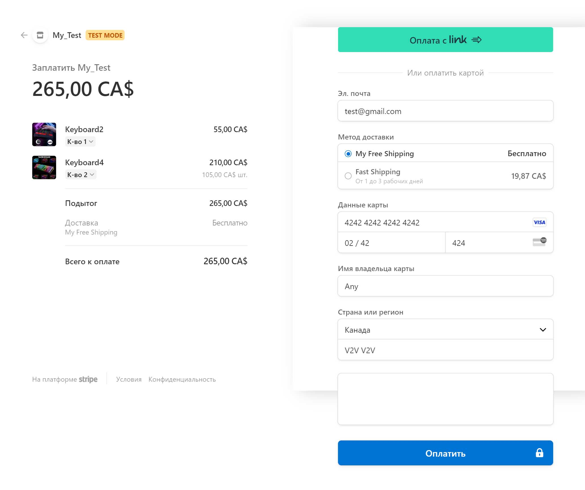
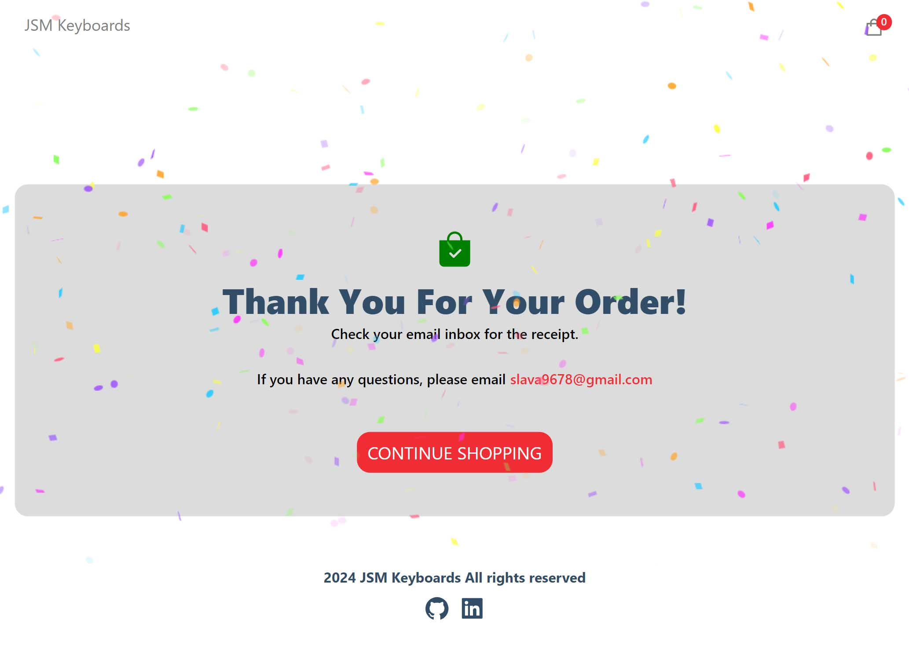

## Getting Started

First, run the development server:

```bash
npm install
npm run dev
```

Open [http://localhost:3000](http://localhost:3000) with your browser to see the result.

---

## Deployed on Vercel

[https://e-commerce-viacheslav.vercel.app](https://e-commerce-viacheslav.vercel.app)

---

### Tech stack:

JS, Next.JS, Sanity, Stripe (payment)

---

### Pages:

- Home
- Product details
- Success
- Checkout (on Product details)

### Preview images

    
